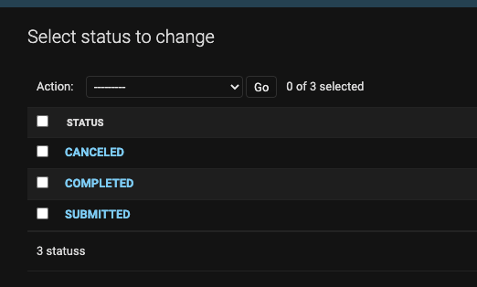

# CarCar

Team:

- Brandon- Auto Sales
- Gilan- Auto Service

## MANDATORY INSTRUCTIONS BEFORE RUNNING APPLICATION

In order to properly assign statuses to service appointments, please complete the following.
The status model needs to be populated with 3 specific instances "SUBMITTED", "COMPLETED", and "CANCELED" via the admin page.

Because the statuses of the service appointments are a part of the service microservice we need to go into docker desktop and access the CLI of following container "project-beta_service_api_1"

Once inside the terminal, make any migrations that may appear and create a super user with the following command "python manage.py createsuperuser". **only a username and password is required**

In the browser, access the admin page using the following URL "http://localhost:8080/admin/" and sign in. Once logged into the admin page, access the status model and create the following instances. "SUBMITTED", "COMPLETED", and "CANCELED".

## Design

This website is designed for a dealership which could be used for many things like creating an service appointment for your car or showing the service history of every car. The website also allows you to create a new employee(ex. sales person or technician), as well as creating a new customer. The end user can record every car sold and every employee that sold said car.

The service, the inventory and the sales are all different microservice using the RESTful API model within their respective bounded context.

- Service
  - Service appointment list
  - Service appointment history
  - Create a service appointment
  - Create a technicians
- Sales
  - Sales List
  - Sales person history
  - Create a sales person
  - Create a sales record
  - Create a customer
- Inventory
  - Create a manufacturer
  - Create a vehicle model
  - Create a automobile
  - Manufacturer list
  - Vehicle model list
  - Automobile list

## Service microservice

### Service Poller

- Retrieves automobile objects as JSON from the inventory microservice via the automobile API. The poller then uses the VIN from this received data to update or creates new objects within the AutomobileVO model. This is where the integration between the service microservice and the inventory microservice occurs.

### Models:

**AutomobileVO**

- Receives VINs from the inventory via service poller.

**Status**

- Provides 1 of 3 statuses for ServiceAppointment.
  - SUBMITTED
  - COMPLETED
  - CANCELED

**Technician**

- Provides a data table for technicians including:
  - Name
  - Employee Number

**ServiceAppointment**

- Provides a data table for service appointments including:

  - VIN
  - Customer
  - Date
  - Time
  - Description
  - Technician (Foreign Key)
  - Status (Foreign Key)

  - Extra data(added via ServiceAppointmentEncoder)
    - VIP (boolean)
      - compares VIN from current model to VIN in AutomobileVO model.
        if VIN matches. VIP status is truthy

## Sales microservice

I created four models which are the AutoVO which only retrieves the vin number from the inventory to make it possible to use it as a foreign key for the records, i made a sales person model to create a sales person and give it a employee number a customer model that lets us create a customer with a name address and a phone number and a record model which uses data from the autoVO model the customer model and the sales person model to create a record.i then started working on my GET and POST requests to create a customer, an employee and a record after i got those working i started working on my poller which fetches data from the automobile model and puts it on the autoVO model i made. After the backend was done i started working on my frontend using React, created the Customer the employee and the record form, after that i made pages to show each list,and made a sales person record list filter to a specific sales person.
